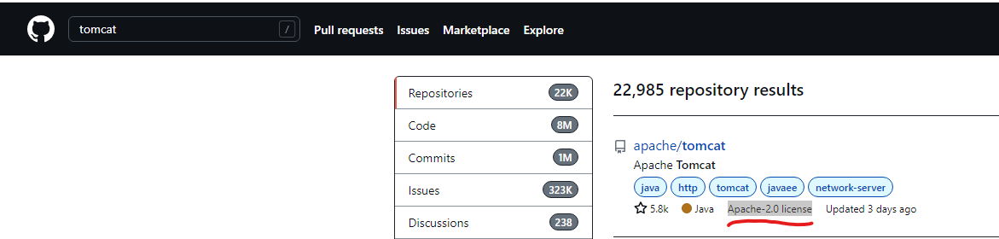
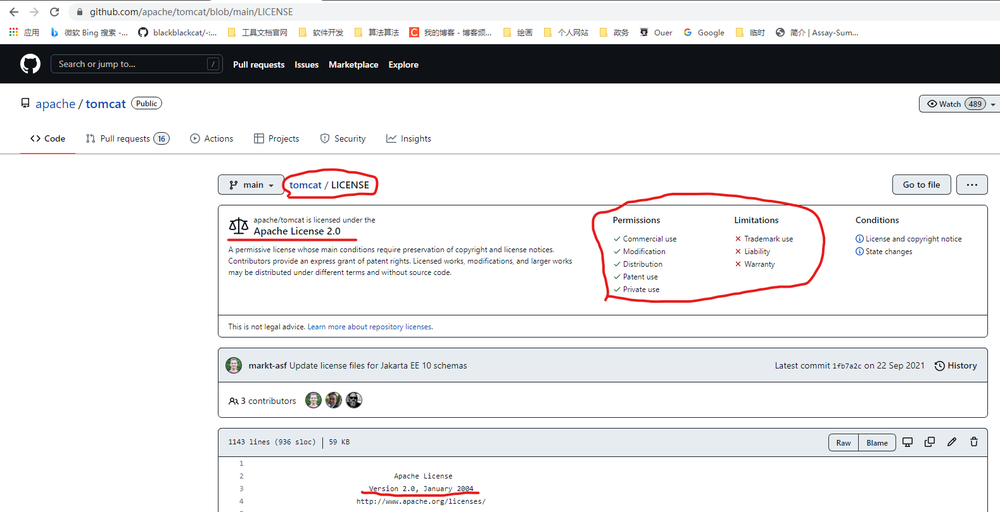

## 开源许可证
开源软件用于声明版权、责任、使用范围的说明文件。主要就是保护自己的劳动成果和避免被人恶意诉讼。
纯个人学习时可以不关心，但是如果开始涉及自研软件、商用时，这些必须清晰。否则遇到白嫖怪、诉棍时后悔也没用。
### 为什么要了解开源许可证
举几个场景说明吧
1. 公司业务开发，引入工具库
    ~~~
    最常见的坑。一边想着“人不能一直造轮子”，然后百度下已有实现，跟着引入一些依赖包，完成任务。
    网上分享属于个人学习交流，可以不考虑许可证.
    但引入商用软件，要么等着原作者发现维权，赔钱或者开源商业软件，要么被公司法务发现，重新花精力整改。
    大公司一般有统一的软件管理仓，可以统一扫描，上黑榜的开源软件还能自己发现。
    小公司或者项目组自己黑搞，那被人告时之前挖坑的估计都跳过几家公司了，雷就是公司自己背了。
    ~~~
2. 开源的软件，被人使用
    ~~~
    许可证也是免责声明。如果开源软件有bug，那应该是引用的人自己评估，而不是提供开源软件的开发者。
    还有被拿去用于非法目的的开发，比如写个伪造健康码什么的，没有许可证就会有一堆预料不到的事。
    ~~~
### 怎么查看软件的许可证类型
一般都是在主目录里的LICENSE文件里说明，github上查看方式如下：

### 业内已有许可证的种类和限制
一图看懂差异

至于如何定义“引用”，是包依赖，还是进程调用都算引用，这种等遇到需要“规避”许可证危害时再补充。

### 怎么增加自己的许可证
待补充

